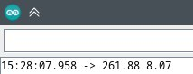
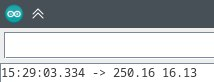

## Комментарий к решению

Мат.ожидание получилось ниже, СКО же получилось выше.
Возможно, какие-то расходы из-за использования digitalWrite
вместо записи в порт напрямую, как это было возможно в Uno R3.
